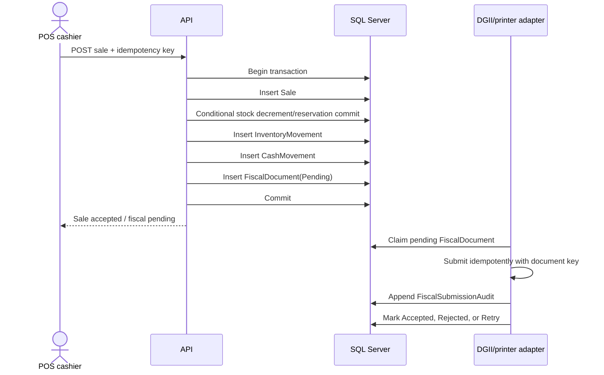

# CuadreEnv financial integrity audit

## Implemented controls

| Area | Diagnosis | Decision and change | Verification |
|---|---|---|---|
| Cash concurrency | Closing was mutable and had no concurrency token. | `CashRegister.RowVersion`, ETag response, EF conflict handling, and `TR_CashRegisters_ImmutableAfterClose`. | Build succeeds; two writers must produce one successful update and one conflict/trigger failure against SQL Server. |
| Inventory concurrency | Stock updates were conditional, but reservation was not committed with the decrement. | `TryCommitReservedStockAsync` conditionally decrements both `Stock` and `ReservedStock`; insufficient stock is an explicit error. | Unit/integration concurrency test still required against SQL Server. |
| Sale/stock/cash atomicity | Inventory movement errors were swallowed. Fiscal integration was absent. | Existing transaction now aborts on movement errors; fiscal state is created as a pending, unique outbox record. External printer/DGII side effects cannot be rolled back and must be retried/reconciled. | Solution build succeeds; migration must be applied to a SQL Server clone. |
| Blind count | Close calculated expected cash and returned submitted amount directly. | Close accepts physical amount/breakdown in the backend, stores expected only after declaration, and returns only `{ closed: true }`. | API test required: call close without physical amount and assert 400; assert response has no expected amount. |
| Discrepancy | Calculation lived in the service. | `CashDiscrepancy.Calculate` is a domain value object with currency rounding. | `Domain.Tests`: 3 passing tests for exact, surplus, shortage and rounding. |
| Immutable history | No database guarantee. | Closed registers and cash movements are protected by SQL Server triggers; movements are append-only. | Apply migration and attempt UPDATE/DELETE in a SQL Server verification script. |
| Authorization | Module filters are currently attributes, not a universal module convention. | Existing fallback authentication policy remains; POS cash movement endpoint must carry module authorization. A central module registry/filter is still required before adding unclassified controllers. | Static audit of controllers plus authorization integration tests are required. |
| License | No `/api/license/verify` consumer exists in this repository. | Do not invent a response contract. Production must fail closed until a signed-cache/grace contract is supplied by USM; development may use explicit local configuration only. | Blocked on USM contract and signing keys. |
| Fiscal NCF/e-CF | No DGII client or durable queue existed. | `FiscalDocument` is a unique company-scoped outbox; `FiscalSubmissionAudit` is separate legal audit storage. | Worker/DGII adapter and retry tests remain required. |
| Resilience | USM HttpClient has a 5-second timeout but no policy-wide retry contract. | Keep bounded timeouts; add Polly only with idempotent operation definitions and retry budgets for USM/DGII. | External endpoint contract and failure-injection tests required. |
| Tenancy | Most business entities use `CompanyId` query filters; `Proyecto` retains legacy `OrganizationId`. | No schema-per-tenant path was found. `Proyecto` is documented as an intentional legacy exception and must not be used for financial records. | SQL metadata audit required for every production FK/index. |

## Database migration

`DataAccess/Migrations/20260911200449_HardenFinancialIntegrity.cs` adds rowversions, blind-count fields, cash movement audit fields, fiscal outbox tables, unique company-scoped document/sequence indexes, and SQL Server append-only triggers.

Apply only through the normal deployment pipeline after checking for duplicate invoice sequence/document keys:

```sql
SELECT CompanyId, COUNT(*) FROM InvoiceSequences GROUP BY CompanyId HAVING COUNT(*) > 1;
SELECT CompanyId, DocumentKey, COUNT(*) FROM FiscalDocuments GROUP BY CompanyId, DocumentKey HAVING COUNT(*) > 1;
```

The migration is not a substitute for a production backup. Take a tested backup before applying it and verify rollback on a restored clone, not on the live database.

## Required production controls before go-live

- SQL Server full backup daily, differential backups at least hourly, and transaction-log backups sized for an RPO of 5 minutes.
- Target RTO: 30 minutes for the API/database pair; validate with a quarterly restore drill.
- Keep financial tables online for the retention period required by fiscal law. Archive `AuditLogs`, `InventoryMovements`, `CashRegisters`, and fiscal audit rows by `OccurredAt`/close date only after legal retention approval.
- Prefer partitioning by date for large audit/Kardex tables; do not partition by `CompanyId` alone because it creates tenant-skew and operational complexity.
- Enable SQL Server temporal history or an equivalent independent audit mechanism for production financial tables after measuring storage and retention impact.
- Add composite tenant-safe keys and foreign keys where cross-company references are possible; validate existing data before adding them.
- Execute a load test with concurrent sales and close attempts against SQL Server, not an in-memory provider.

## Critical sequence



## Test status

- Domain discrepancy tests: passing (3/3).
- Full solution build: passing.
- SQL Server migration execution: not run in this environment.
- Integration flow, DGII retry/idempotency, license outage/grace, restore drill, and POS load tests: not yet available; these require test infrastructure and external contracts.
